# LangGraph Multi-Agent Research System

A powerful demonstration of multi-agent collaboration using [LangGraph](https://github.com/langchain-ai/langgraph). This project orchestrates two autonomous agents—a **Researcher** and a **Writer**—to automatically generate comprehensive blog posts on any given topic.

## 🌟 Introduction

In the era of Generative AI, agents that can perform specific tasks are becoming increasingly valuable. This system showcases how to chain multiple agents together to solve complex workflows:

1.  **Research Phase**: An agent searches the web for real-time information.
2.  **Writing Phase**: An LLM-powered agent synthesizes the found information into a coherent narrative.

This architecture enables the production of content that is both factually grounded (via search) and well-written (via LLM).

## 🏗️ Architecture

The system is built as a state graph where data flows between nodes (agents).

```mermaid
graph TD
    Start([Start]) --> Input[User Input]
    Input --> Researcher
    
    subgraph "Agent Graph"
        Researcher[🔎 Researcher Agent]
        Researcher -->|Research Data| Writer[✍️ Writer Agent]
    end
    
    Writer --> Output[Final Blog Post]
    Output --> End([End])
```



### Components

*   **Researcher Agent**: 
    *   **Tool**: DuckDuckGo Search
    *   **Role**: Queries the web for the user's topic to gather context and facts.
    *   **Output**: A list of search results/summaries.

*   **Writer Agent**:
    *   **Tool**: Local LLM (Ollama / Llama 3)
    *   **Role**: Takes the research data and constructs a blog post.
    *   **Output**: Streamed text response.

## 🚀 Features

*   **Autonomous Research**: No need to manually search for information.
*   **Local Privacy**: Uses [Ollama](https://ollama.com/) for local inference (no API keys required for the LLM).
*   **Streaming Output**: Watch the writer generate the post in real-time.
*   **State Management**: Uses LangGraph's stateful architecture to pass context reliably.

## 🛠️ Prerequisites

Before running the project, ensure you have the following installed:

1.  **Python 3.9+**: [Download Python](https://www.python.org/downloads/)
2.  **Ollama**: [Download Ollama](https://ollama.com/download)
3.  **Llama 3 Model**:
    Pull the model locally using Ollama:
    ```bash
    ollama pull llama3
    ```

## 📦 Installation

1.  **Clone the Repository**
    ```bash
    git clone https://github.com/abheeyeee/Multi-Agent-System-With-LangGraph.git
    cd Multi-Agent-System-With-LangGraph
    ```

2.  **Install Dependencies**
    It is recommended to use a virtual environment.
    ```bash
    python -m venv venv
    source venv/bin/activate  # On Windows: venv\Scripts\activate
    pip install -r requirements.txt
    ```

## 💻 Usage

1.  **Start the Application**
    Ensure your Ollama server is running (usually it runs in the background).
    ```bash
    python main.py
    ```

2.  **Enter a Topic**
    When prompted, type the topic you want to research:
    ```
    Please provide a topic: The Future of Quantum Computing
    ```

3.  **View Output**
    *   The Researcher will log its search process.
    *   The Writer will stream the generated blog post to the console.

## 📂 Project Structure

*   `main.py`: Entry point. Handles user input and invokes the graph.
*   `agents.py`: Contains the logic for `researcher_node` and `writer_node`.
*   `graph_builder.py`: Defines the LangGraph workflow structure (nodes and edges).
*   `state.py`: TypedDict definition of the shared state (`AgentState`).
*   `requirements.txt`: Python package dependencies.

## ❓ Troubleshooting

*   **Connection Error (Ollama)**: Ensure Ollama is running (`ollama serve`). By default it listens on localhost:11434.
*   **Search Errors (429/DNS)**: DuckDuckGo might rate limit requests. If this happens, wait a few moments and try again.
*   **Missing Model**: If the Writer fails, ensure you ran `ollama pull llama3`.

---
*Built with LangGraph, LangChain, and Ollama.*
